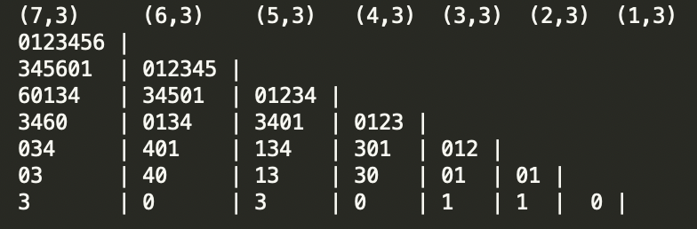

#### 2021-12-23 ~ 2021-12-27  
요세푸스 문제(DP, Segment tree) 시리즈, 데이터 구조, 최대공약수, 소수 찾기  
Document TODO:: 임계경로, Treasure Hunter  
Solving TODO:: Similarity(BOJ 23245), DP, Dijkstra, 북랜디  

요세푸스 문제는 해답을 많이 참고했다. 지금 내 실력에서는 어쩔 수 없다고 생각한다.  
특히 마지막 자리를 구하는 DP 문제는 절대 못 풀었을 만한 난이도였다 (구사과도 난이도 기여에 그렇다고 적었다)  
DP 문제는, 특히 해답을 보고 푼 DP 문제는 풀어도 푼 것 같지 않은 찝찝함이 있다.  
최대한 DP 문제인 것을 모르고 풀고, 할 수 있는 만큼 고민한 후에만 해답을 보자.  
아이디어를 최대한 잘 정리해서 내 것으로 만드는게 최선인 듯 하다.  
오히려 세그먼트 트리를 이용한 순열 문제가 더 직관적으로 잘 이해할 수 있었다.  
처음으로 세그먼트 트리를 사용했는데 즐거운 공부 및 구현 경험이었다.  

## 1. 요세푸스 문제 3 (BOJ 11025)  
마지막으로 살아남는 자리를 구하는 문제  
큐를 이용한 풀이에서 점화식을 발견할 수 있다.  
첫 요세푸스 문제를 큐로 풀었지만, 점화식을 찾지 못했다.   

#### 풀이  
각 수열은 큐를 이용해서 푸는 경우와 같은 것이다. N = 7, K = 3 일 때    
0123456에서 3번째 사람을 제거하기 전까지는 큐에서 꺼낸 후 다시 큐에 넣는다. 즉 345601이 된다.  
아래 사진은 N명의 사람이 있는 경우부터 1명의 사람이 있는 경우까지 큐의 상태를 나타낸 것이다.  

  

위의 각 줄의 큐를 x[i]라 하고 바로 왼쪽의 큐를 x[i+1]이라 할 때 모든 줄에 놓인 큐의 수열들은 다음의 관계식을 만족한다.   
x[i+1] = (x[i] + K) % (i+1)  (1 <= i < N)     

예를 들어 (6,3)에 있는 0134는 (5,3)에 있는 3401 각 각의 자리에 K인 3을 더한 후 6으로 나눈 나머지와 같다.  
3 + 3 % 6 = 0  
4 + 3 % 6 = 1  
0 + 3 % 6 = 3  
1 + 3 % 6 = 4  

그러므로 마지막 남는 사람을 구하려면 다음과 같은 연산을 적용하면 된다.  
f(2) = (f(1) + K) % 2  
f(3) = (f(2) + K) % 3  
...   
f(N) = (f(N-1)+K) % N  

위의 예시를 해보면 (1,3)의 0에서 (7,3)까지 모두 성립하는 것을 알 수 있다.  
(0+3) % 2 = 1    
(1+3) % 3 = 1  
(1+3) % 4 = 0  
(0+3) % 5 = 3  
(3+3) % 6 = 0  
(0+3) % 7 = 3   

해당 방법은 0 ~ (N-1)로 수열을 바꿀 때 성립한다.  

## 2. 요세푸스 문제 2 (BOJ 1168)  

문제 풀이를 위해 두 가지가 필요하다.   
(1) 다음의 제거해야 할 사람이 전체 배열에서 몇 번째 사람인지 찾는 방법      
(2) (1)에서 구한 제거해야할 K번째 사람을 효율적으로 제거할 수 있는 자료구조   

(1)  
다음에 제거해야할 사람은 다음과 같은 식으로 찾을 수 있다.   
그 전에 제거한 사람의 번호를 prev라 하고 현재 사람수를 sz라 하고  
cur을 이번에 제거할 사람의 번호라 하면, 위 문제와 다르게 cur은 \[1,N\]의 범위를 가진다.  
cur = (prev - 1 + K) % sz   
cur이 0이라면 마지막 사람을 제거하는 경우로 cur += sz를 해준다.    

(7,3)의 경우  
첫 번째 사람을 제거하고 prev는 3으로 시작한다.  
(3 - 1 + 3) % 6 = 5  
(5 - 1 + 3) % 5 = 2  
(2 - 1 + 3) % 4 = 0 => 0+4  
(4 - 1 + 3) % 3 = 0 => 0+3  
(3 - 1 + 3) % 2 = 1  
(1 - 1 + 3) % 1 = 0 => 0+1  

각 각의 경우 답과 배열의 상태는 아래와 같다.  
cur = 5 | 124567  
cur = 2 | 12457
cur = 4 | 1457 
cur = 3 | 145  
cur = 1 | 14 
cur = 1 | 4 

몇 번째 사람을 제거할 것인지 구하는 식은 11025번 문제의 점화식이랑 조금 닮았는데, 연관은 잘 모르겠다.  
문제 풀이에서 본 문제를 먼저 풀었는데도, 점화식을 구할 수 없었다.  
이 식은 손으로 풀어서 찾을 수 있었는데, 우연히 찾은 것 같기도 하다.  

(2)  
세그먼트 트리를 이용하면, 배열 내의 K번째 사람을 logN 만에 찾을 수 있고, logN으로 제거할 수 있다.  
초기 세그먼트 트리의 각 리프 노드는 처음 사람의 수와 같고 아직 남아 있으므로 각 값을 1로 설정한다.  
빠지는 사람을 담당하는 리프노드와 엮여있는 모든 구간에 -1 을 해주면 된다.  

만약 내가 어떻게 푸는지 몰랐다고 생각했을 때 (1) (2)를 떠올릴 수 있었을까 ?  

## 3. 데이터 구조

들어올 수 있는 수의 개수 만큼 리프노드를 가지는 세그먼트 트리를 미리 만든다. (들어올 때 마다 세그먼트 트리를 늘리는 것이 아니다)
그 수가 들어온 경우 엮이는 구간에 모두 +1 을 하고 삭제되는 경우 -1 을 한다.    

처음에는 일반 트리처럼 insert 로직이 따로 있는 줄 알았다.  
하지만 세그먼트 트리는 미리 가능한 최대 개수 만큼 구간을 미리 만들어 놓는 무지막지한 녀석이었다.  
그 방법을 이해하고 나니 요세푸스 문제 2랑 같은 문제로 바뀌었다.   

